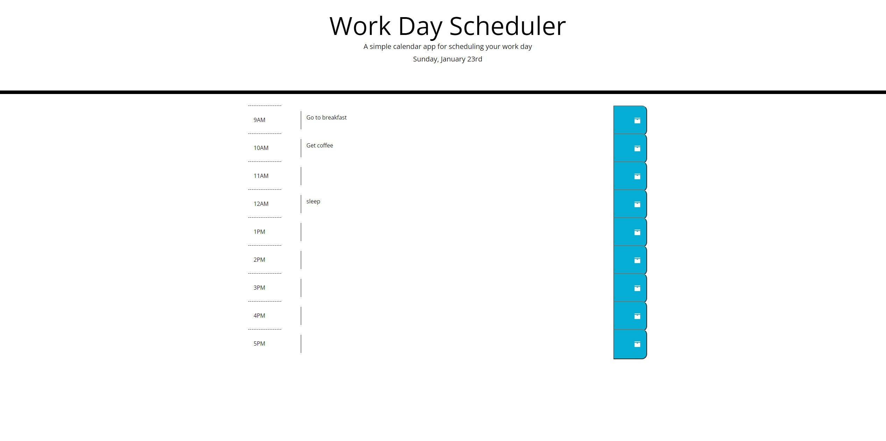

# Schedule-Planner

## Purpose
This webpage has a daily event planner that can be editted and saved across browser refreshes. 
The time blocks will be color coded to indicate whether that hour is in the past, present, or future.

## Outline
* in the header a display is shown describing the event planner, as well as the current day
* beneath are 9 rows that contain an hour, a textarea, and a button that saves the input.

## Built With
* HTML
* CSS
* Javascript

## Screenshot

## Website
https://j-maclellan.github.io/schedule-planner/

## Contributor
* j-maclellan